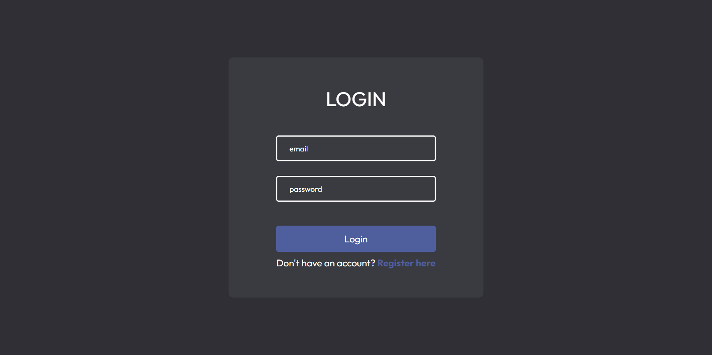
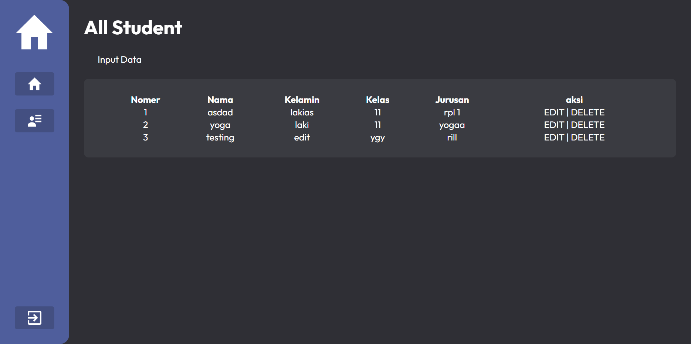

# WDC Admin Panel
WDC Admin Panel is a panel admin website that makes it easy for users to manage student data. With the login and register features, users can access two main parts of the panel admin, which is to explain about projects created and manage student data through the CRUD feature. With an intuitive interface and strong features, WDC Admin Panel helps users in editing, delete, add, and view student data efficiently and effectively.

## Table of contents

- [Overview](#overview)
  - [Screenshot](#screenshot)
  - [Links](#links)
- [My process](#my-process)
  - [Built with](#built-with)
- [Author](#author)

## Overview

### Screenshot

### Links

- Live Site URL: [Live Site](https://wdc-admin-panel.000webhostapp.com)

### Built with

- PHP
- Semantic HTML5 markup
- CSS custom properties
- Flexbox

